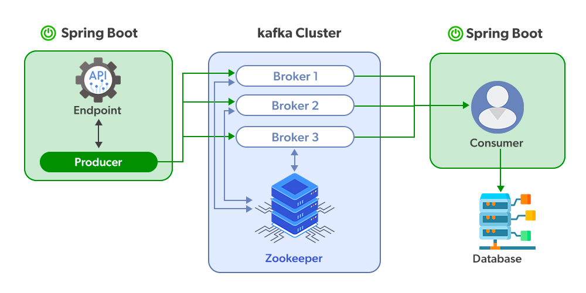

1. Start Kafka cluster

```sh
docker-compose -f kafka-cluster.yml up
```
2. Start Consumer & Producer
Commands:
```sh
*  docker-compose -f producer-consumer.yml up
```

3. Scale Consumer 
```sh
docker-compose -f producer-consumer.yml up --scale consumer=2
```


### Kafka Vocabulary:

* Producer: A producer is a client that sends messages to the Kafka server to the specified topic.
* Consumer: Consumers are the recipients who receive messages from the Kafka server.
* Broker: Brokers can create a Kafka cluster by sharing information using Zookeeper. A broker receives messages from producers and consumers fetch messages from the broker by topic, partition, and offset.
* Cluster: Kafka is a distributed system. A Kafka cluster contains multiple brokers sharing the workload.
* Topic: A topic is a category name to which messages are published and from which consumers can receive messages.
* Partition: Messages published to a topic are spread across a Kafka cluster into several partitions. Each partition can be associated with a broker to allow consumers to read from a topic in parallel.
* Offset: Offset is a pointer to the last message that Kafka has already sent to a consumer.
